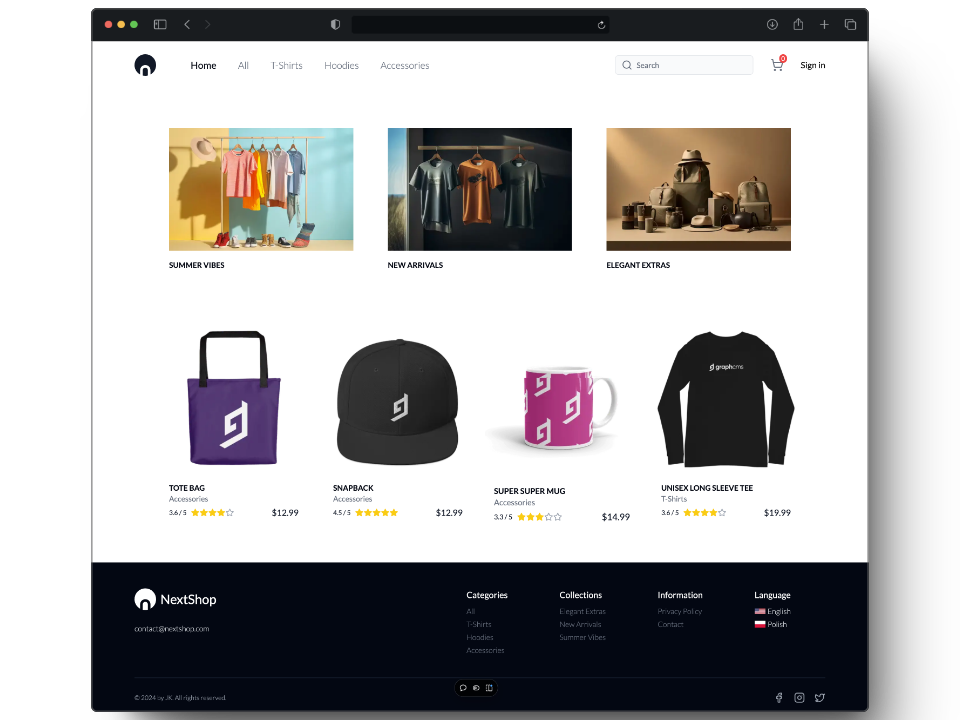

<div align='center'>

<picture>
  <source media="(prefers-color-scheme: dark)" srcset="public/logodark.png">
  
</picture>

#

TECH<strong>STACK</strong>

)


##

APP<strong>DEMO</strong>

<a href="https://nextjs14masters-course.vercel.app" style='color: red;'>`https://nextjs14masters-course.vercel.app`</a>

##

APP<strong>CONFIG</strong>

<div align='left'>

> <i>1. Clone this repository and install dependencies</i>
>
> `git clone https://github.com/jaroslawkucharski/nextjs14masters.git`
>
> `cd nextjs14masters`
>
> `pnpm install`

</div>

<div align='left'>

> <i>2. Add envs to the project</i>
>
> > ```
> > # DOMAIN
> > NEXT_PUBLIC_URL=
> >
> > # GRAPHQL API
> > GRAPHQL_URL=
> > GRAPHQL_IMAGE_URL=
> > 
> > # STRIPE
> > STRIPE_SECRET_KEY=
> > STRIPE_WEBHOOK_SECRET=
> > NEXT_PUBLIC_STRIPE_PUBLISHABLE_KEY=
> > 
> > # CLERK
> > NEXT_PUBLIC_CLERK_PUBLISHABLE_KEY=
> > CLERK_SECRET_KEY=
> > NEXT_PUBLIC_CLERK_SIGN_IN_URL=/sign-in
> > NEXT_PUBLIC_CLERK_SIGN_UP_URL=/sign-up
> > NEXT_PUBLIC_CLERK_AFTER_SIGN_IN_URL=/
> > NEXT_PUBLIC_CLERK_AFTER_SIGN_UP_URL=/
> > 
> > # ALGOLIA
> > NEXT_PUBLIC_ALGOLIA_APP_ID=
> > NEXT_PUBLIC_ALGOLIA_API_KEY=
> > NEXT_PUBLIC_ALGOLIA_INDEX_NAME=
> > ```

</div>

<div align='left'>

> <i>4. Fire up the app with `pnpm dev` and... Enjoy!</i>

</div>

>

</div>
